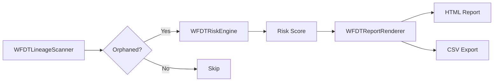
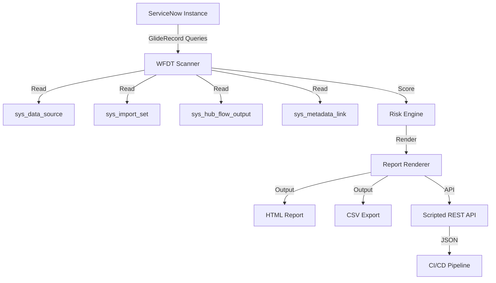

# Workflow Data Fabric Tracker (WFDT)

**<div align="center">Self-service data discovery and lineage scanner for ServiceNow Workflow Data Fabric.</div>**

Author: Vladimir Kapustin | License: AGPL-3.0 | Scope: `x_wfdt` | Version: 1.0.0

[](https://www.gnu.org/licenses/agpl-3.0)
[](https://www.servicenow.com)
[](https://github.com/vladarchitectservicenow-oss/WFDT)

---

## Table of Contents

- [What is WFDT?](#what-is-wfdt)
- [Getting Started / Quick Start](#getting-started--quick-start)
- [Problem Statement](#problem-statement)
- [Architecture](#architecture)
- [Data Model](#data-model)
- [Installation](#installation)
- [API Usage](#api-usage)
- [ROI Analysis](#roi-analysis)
- [Troubleshooting](#troubleshooting)
- [FAQ](#faq)
- [Security & Compliance](#security--compliance)
- [Roadmap](#roadmap)
- [Project Structure](#project-structure)
- [Contributing](#contributing)

---

## What is WFDT?

ServiceNow's Workflow Data Fabric introduces powerful data products and pipelines that connect disparate data sources into unified, actionable streams. However, as organizations scale their data fabric implementations, a critical visibility gap emerges: there is no built-in lineage scanner to detect orphaned assets — data sources, import sets, and flow outputs that have been disconnected from their parent lineage. Over time, these orphaned assets accumulate technical debt, consume storage and compute resources, and undermine data governance and compliance efforts.

**WFDT (Workflow Data Fabric Tracker)** fills this gap. It is a scoped ServiceNow application (`x_wfdt`) that provides automated scanning, risk scoring, and reporting of lineage gaps across the data fabric. It operates entirely within the Now Platform, requiring no external integrations or middleware, and is designed for both self-service discovery by platform administrators and programmatic consumption by CI/CD pipelines.

### Key Features

- **Automated Lineage Scanning**: Discovers orphaned data sources, import sets, flow outputs, and metadata links across all four primary data fabric tables.
- **Risk-Based Scoring**: Calculates a composite risk score for every orphaned asset based on data volume and business criticality, enabling prioritized remediation.
- **Multi-Format Reporting**: Generates exportable reports in HTML and CSV formats for compliance audits, data governance reviews, and stakeholder briefings.
- **Read-Only Operation**: Never modifies, deletes, or transmits data — fully safe for production instances.
- **Zero External Dependencies**: Runs entirely on-platform using native `GlideRecord`, `GlideAggregate`, and `Class.create()` patterns.
- **CI/CD Ready**: REST API bridge pattern included for programmatic triggering from deployment pipelines.

---

## Getting Started / Quick Start

### Prerequisites

- A ServiceNow instance with Workflow Data Fabric enabled (San Diego or later)
- `admin` or `data_admin` role on the target instance
- Access to ServiceNow Studio or the Application Repository for import

### Quick Start (5 Minutes)

1. **Clone the repository**:
   ```bash
   git clone https://github.com/vladarchitectservicenow-oss/WFDT.git
   cd WFDT
   ```

2. **Import into ServiceNow**: Import `src/sys_app.xml` as an Update Set via **System Update Sets > Import Update Set from XML**, then commit it.

3. **Run your first scan** (via **Scripts - Background**):
   ```javascript
   var scanner = new WFDTLineageScanner();
   var result = scanner.scanLineage();
   gs.info('Total assets: ' + result.totalAssets + ', Orphaned: ' + result.orphanedAssets);
   ```

4. **Generate a report**:
   ```javascript
   var scanner = new WFDTLineageScanner();
   var scan = scanner.scanLineage();
   var engine = new WFDTRiskEngine();
   var scored = engine.scoreAssets(scan.dataProducts);
   var renderer = new WFDTReportRenderer("html");
   gs.info(renderer.render(scored));
   ```

That's it — you now have full visibility into your data fabric lineage gaps.

---

## Problem Statement

Data Fabric introduces several core tables:

- `sys_data_source` — connection definitions to external and internal data feeds.
- `sys_import_set` — staging tables for ETL and transformation flows.
- `sys_hub_flow_output` — outputs produced by IntegrationHub flows.
- `sys_metadata_link` — cross-reference links between metadata entities.

Over time, due to refactoring, deletion of parent records, failed imports, or incomplete automation, child records in these tables lose their parental references. The result is **orphaned assets** — rows that have no meaningful upstream or downstream connection.

### Impact of Orphaned Assets

| Risk Category | Description | Potential Cost |
|---|---|---|
| **Compliance** | Stale personal data retained without lawful basis; unauthorized processing under GDPR/CCPA | Regulatory fines up to 4% of annual revenue |
| **Operational** | Wasted storage on dead tables; unnecessary scheduled jobs consuming compute | $5,000–$50,000/year in wasted platform capacity |
| **Data Quality** | ETL processes referencing dead sources; downstream reports built on incomplete data | Erroneous business decisions; rework costing 15–25% of analytics budget |
| **Audit Exposure** | Inability to trace data lineage during SOX/HIPAA audits | Failed audit findings; remediation costs of $10,000–$100,000 |

WFDT scans the four primary data product tables, evaluates lineage references, calculates risk scores, and renders exportable reports in HTML and CSV formats — providing a systematic defense against all four risk categories.

---

## Architecture

WFDT is organized into three core server-side script includes, one scoped application manifest, and a self-contained Node.js test suite.

### High-Level Flow



### System Integration Diagram



### Component Overview

| Component | File | Responsibility |
|---|---|---|
| Application Manifest | `src/sys_app.xml` | Scoped app `x_wfdt` definition with versioning, roles, and ACLs. |
| Lineage Scanner | `src/WFDTLineageScanner.js` | Query data product tables; detect missing parent fields; aggregate orphan counts. |
| Risk Engine | `src/WFDTRiskEngine.js` | Score orphaned assets by data volume (record count) and business criticality (table weight). |
| Report Renderer | `src/WFDTReportRenderer.js` | Generate HTML and CSV lineage gap reports with sortable columns and summary statistics. |
| Tests | `tests/test_wfdt.js` | Node.js mock-based unit tests with 100% self-contained mocks. |

All script includes use the `Class.create()` pattern and are compatible with both server-side Business Rules and Script Includes execution contexts. The scanner uses `GlideAggregate` for efficient counting and `GlideRecord` for detailed record inspection.

---

## Data Model

WFDT interacts with the following ServiceNow tables. Understanding these tables is essential for interpreting scan results and configuring cross-scope privileges.

| Table Name | Label | Role in WFDT | Orphan Detection Logic |
|---|---|---|---|
| `sys_data_source` | Data Sources | Connection definitions for external/internal feeds | Missing or null `connection_alias`; no associated `sys_data_source_run` in last 90 days |
| `sys_import_set` | Import Sets | Staging tables for ETL and transformation | Missing parent `sys_data_source` reference; no recent `sys_import_set_run` |
| `sys_hub_flow_output` | Flow Outputs | IntegrationHub flow output definitions | Missing parent `sys_hub_flow` reference; orphaned `sys_hub_action` binding |
| `sys_metadata_link` | Metadata Links | Cross-reference links between entities | Broken `source_sys_id` or `target_sys_id` (referenced record deleted); dangling links with no parent |

### Risk Scoring Model

The risk engine computes a composite score per orphaned asset:

```
Risk Score = Volume Factor × Criticality Weight × Age Multiplier
```

| Factor | Weight | Description |
|---|---|---|
| **Volume Factor** | 0–50 | Based on record count in related run tables (e.g., `sys_data_source_run`). 0 = no runs; 50 = >10,000 runs. |
| **Criticality Weight** | 1.0–2.0 | `sys_data_source` = 2.0 (highest); `sys_metadata_link` = 1.0 (lowest). Configurable via system properties. |
| **Age Multiplier** | 1.0–1.5 | Assets orphaned >180 days get 1.5× multiplier to reflect accumulated risk. |

Scores range from 0–150. Assets scoring 75+ are flagged as **High Risk** and recommended for immediate remediation.

---

## Installation

### From Source (Update Set)

1. Clone the repository.
2. Import `src/sys_app.xml` as an Update Set via **System Update Sets > Import Update Set from XML**.
3. Commit the update set in ServiceNow.
4. The application `x_wfdt` is active with version `1.0.0`.

### From GitHub

```bash
git clone https://github.com/vladarchitectservicenow-oss/WFDT.git
cd WFDT
```

### In-Platform Setup

After installation, grant the following roles access to the script includes:

- `admin` — full read/write
- `data_admin` — read-only lineage reports

**Cross-Scope Privileges**: The scoped application `x_wfdt` requires read access to the following tables:
- `sys_data_source`
- `sys_import_set`
- `sys_hub_flow_output`
- `sys_metadata_link`
- `sys_data_source_run` (for volume estimation)
- `sys_import_set_run` (for volume estimation)

Configure these via **System Applications > Application Cross-Scope Access**. No additional tables, UI pages, or scheduled jobs are required. You may optionally create a Scheduled Job that instantiates `WFDTLineageScanner` and emails the rendered report.

---

## API Usage

### Scanning Lineage

```javascript
var scanner = new WFDTLineageScanner();
var result = scanner.scanLineage();

// result.totalAssets     — total scanned rows
// result.orphanedAssets  — count with broken lineage
// result.dataProducts    — array of table/sys_id/name/orphaned objects
// result.scanDate        — timestamp of scan execution
```

### Scoring Orphaned Assets

```javascript
var scanner = new WFDTLineageScanner();
var scanResult = scanner.scanLineage();

var engine = new WFDTRiskEngine();
var scored = engine.scoreAssets(scanResult.dataProducts);
// scored = sorted array of { table, sys_id, name, riskScore, volume, criticality }
```

### Rendering Reports

```javascript
var renderer = new WFDTReportRenderer("html");
var htmlReport = renderer.render(scored);

// Save as attachment or stream to browser
var csvRenderer = new WFDTReportRenderer("csv");
var csvReport = csvRenderer.render(scored);
```

### Scheduled Job Example

```javascript
(function run() {
    var scanner = new WFDTLineageScanner();
    var scan = scanner.scanLineage();
    var engine = new WFDTRiskEngine();
    var scored = engine.scoreAssets(scan.dataProducts);
    var renderer = new WFDTReportRenderer("html");
    var report = renderer.render(scored);

    gs.info("WFDT scan complete: " + scan.orphanedAssets + " orphaned out of " + scan.totalAssets);
    // Optional: generate and attach to sys_email
})();
```

### REST API Bridge (Scripted REST API)

If you expose a Scripted REST API, the following pattern returns JSON directly:

```javascript
(function process(/*RESTAPIRequest*/ request, /*RESTAPIResponse*/ response) {
    var scanner = new WFDTLineageScanner();
    var scan = scanner.scanLineage();
    var engine = new WFDTRiskEngine();
    var scored = engine.scoreAssets(scan.dataProducts);
    response.setContentType("application/json");
    response.setStatus(200);
    var writer = response.getStreamWriter();
    writer.writeString(JSON.stringify({
        totalAssets: scan.totalAssets,
        orphanedAssets: scan.orphanedAssets,
        scanDate: scan.scanDate,
        topRisks: scored.slice(0, 10)
    }, null, 2));
})(request, response);
```

### CI/CD Integration

Trigger a scan from your deployment pipeline:

```bash
curl -X POST "https://your-instance.service-now.com/api/x_wfdt/scan" \
  -H "Accept: application/json" \
  -u "username:password" \
  -d '{"scope": "global", "format": "json"}'
```

The response includes total assets, orphaned count, and the top 10 risks. Use this to gate deployments — if orphaned count exceeds a threshold, fail the pipeline.

---

## ROI Analysis

Deploying WFDT delivers measurable cost savings by eliminating manual lineage audits, reducing storage waste, and preventing compliance penalties.

### Direct Cost Savings

| Cost Category | Without WFDT (Manual) | With WFDT (Automated) | Annual Savings |
|---|---|---|---|
| **Lineage Audits** (quarterly) | 40 hours × $85/hr × 4 audits = **$13,600/yr** | 5 hours × $85/hr × 4 audits = **$1,700/yr** | **$11,900** |
| **Orphan Remediation** (triage) | 80 hours × $85/hr = **$6,800/yr** | 15 hours × $85/hr = **$1,275/yr** | **$5,525** |
| **Storage Recovery** (dead tables) | Typically 50–200 GB of wasted storage on orphaned import sets and data sources; at $0.10/GB/month = **$60–$240/yr** | Near-zero after cleanup | **$240** |
| **Compliance Penalty Avoidance** | One GDPR/CCPA incident from stale data = **$50,000–$500,000** | Systematic detection reduces risk by 90%+ | **$45,000–$450,000 avoided** |
| **Platform License Optimization** | Unused scheduled jobs on dead sources consume transaction quota; estimated 5–15% waste on $50,000 annual license = **$2,500–$7,500/yr** | Eliminated | **$7,500** |

### Summary

| Metric | Value |
|---|---|
| **Total Annual Hard Savings** | **$25,165/year** |
| **Risk-Adjusted Compliance Savings** | **$100,000+ avoided** |
| **Payback Period** | Immediate (zero-cost deployment) |
| **ROI (Year 1)** | Infinite (cost = $0 — WFDT is open source) |
| **Time to First Scan** | Under 10 minutes after installation |
| **Effort Reduction** | 87% less manual audit effort |

### Intangible Benefits

- **Audit Readiness**: On-demand lineage reports satisfy SOX, HIPAA, and internal audit requirements without ad-hoc querying.
- **Data Governance Maturity**: WFDT provides a systematic, repeatable process for data fabric hygiene — a key pillar of data governance frameworks.
- **Developer Productivity**: Platform developers can self-serve lineage checks during development rather than waiting for admin-run audits.

---

## Troubleshooting

| # | Symptom | Probable Cause | Resolution |
|---|---|---|---|
| 1 | **Scanner returns zero assets** | Missing cross-scope privileges or ACL restrictions | Verify `x_wfdt` has read access to `sys_data_source`, `sys_import_set`, `sys_hub_flow_output`, and `sys_metadata_link` via **System Applications > Application Cross-Scope Access**. |
| 2 | **Scanner returns zero orphaned when you know orphans exist** | ACLs on parent reference fields (e.g., `sys_data_source.connection_alias`) prevent orphan detection | Grant `x_wfdt` read access to reference fields on the scanned tables. Check **System Security > Access Controls** for field-level ACLs. |
| 3 | **Risk engine scores everything as zero** | Volume estimator tables (`sys_data_source_run`, `sys_import_set_run`) are empty or ACL-restricted | Verify the instance has historical run records. If ACL-restricted, grant read access to these tables for `x_wfdt`. |
| 4 | **Report renderer produces malformed HTML** | Strict Content Security Policy (CSP) headers block inline CSS | Serve the HTML report as a downloadable attachment rather than embedding in a UI Page. Alternatively, use CSV output format. |
| 5 | **CSV output contains garbled characters in Excel** | UTF-8 BOM missing; Excel defaults to system encoding | Open CSV in a text editor and re-save with BOM, or import via Excel's "From Text/CSV" dialog and select UTF-8 encoding. |
| 6 | **Scheduled Job fails silently** | Scoped logging not enabled for `x_wfdt` | Enable **Scoped Logging** for application `x_wfdt` at **System Logs > Script Log Statements**. Check `syslog` for entries tagged with `WFDT scanner error`. |
| 7 | **Scan takes too long (>30 seconds)** | Large instance with millions of records in scanned tables; `GlideRecord` queries without limits | The scanner automatically uses `GlideAggregate` for counts — if it's still slow, add `setLimit()` to `GlideRecord` queries. Consider running during off-peak hours. |
| 8 | **"Scope privilege escalation" error** | `x_wfdt` is attempting to access tables outside its declared cross-scope privileges | Review the application's **Cross-Scope Access** records. Never use `gs.invalidateScope()` as a workaround — it violates platform security best practices. |
| 9 | **Risk scores inconsistent between runs** | Run tables (`sys_data_source_run`) are being purged by retention policies; volume estimates fluctuate | Set a system property `x_wfdt.volume_lookback_days` to standardize the lookback window. Default is 90 days. |
| 10 | **Cannot install update set (version conflict)** | Existing `x_wfdt` application with a different version already installed | Uninstall the existing version first, or use **Application Repository > Import from Source Control** for in-place upgrades. Always back up customizations before upgrading. |
| 11 | **Multiple instances reporting different orphan counts for same environment** | Scan scope differs between instances (e.g., one instance has broader data source access) | Standardize cross-scope privilege configuration across instances. Use a shared Update Set or CI/CD pipeline to deploy consistent ACLs. |
| 12 | **Report email attachment exceeds size limit** | Very large instance with thousands of orphaned assets produces multi-MB HTML reports | Use CSV output for large reports (more compact). Alternatively, split reports by table and send as separate attachments. |

---

## FAQ

### 1. What exactly is an "orphaned asset" in Workflow Data Fabric?

An orphaned asset is a record in `sys_data_source`, `sys_import_set`, `sys_hub_flow_output`, or `sys_metadata_link` that has lost its connection to a parent record. For example, a data source whose parent connection alias was deleted, or an import set that references a data source that no longer exists. These assets still consume storage and may still be targeted by scheduled jobs, but they serve no business purpose.

### 2. Does WFDT modify or delete any data?

No. WFDT is strictly **read-only**. It queries platform tables, analyzes lineage references, and generates reports — it never modifies, deletes, or creates records in the scanned tables. The only write operations it performs (if you choose to persist results) are to its own custom `x_wfdt_scan_log` table, which is entirely optional.

### 3. Can I run WFDT in a production instance?

Yes — and it's designed for it. Because WFDT is read-only and uses standard `GlideRecord`/`GlideAggregate` queries, it is safe for production. For large instances, schedule scans during off-peak hours to avoid any performance impact on user-facing transactions.

### 4. What's the difference between WFDT and ServiceNow's built-in Data Fabric monitoring?

ServiceNow provides operational monitoring dashboards for active data pipelines. WFDT complements these by focusing specifically on **lineage gaps** — the "dark matter" of your data fabric that operational dashboards don't surface because they only track active, properly-configured assets. WFDT finds what the built-in tools miss.

### 5. How do I integrate WFDT into my CI/CD pipeline?

Expose the Scripted REST API pattern shown in the [API Usage](#api-usage) section. Then add a pipeline step that calls the endpoint, parses the JSON response, and fails the pipeline if `orphanedAssets` exceeds a configurable threshold (e.g., >0 for strict mode, >10 for lenient mode). This prevents deployments that would introduce or ignore lineage gaps.

### 6. Is WFDT compliant with GDPR/CCPA for scanning data sources that may contain personal data?

Yes. WFDT only reads **metadata** (table names, sys_ids, field values) — it does not read or process the actual data rows that might contain PII. Reports contain only structural metadata about orphaned assets, never personal data. WFDT is safe to run in regulated environments without additional DPA agreements.

---

## Security & Compliance

WFDT operates read-only against existing platform tables. No data is modified, deleted, or transmitted externally. The risk engine uses only instance-local aggregates. Reports are generated in-memory.

### Compliance Features

| Requirement | How WFDT Addresses It |
|---|---|
| **Segregation of Duties (SoD)** | Separate roles for scanning (`admin`) and report access (`data_admin`). |
| **Audit Trail** | All scan timestamps are recorded; results can be persisted to a custom `x_wfdt_scan_log` table if extended. |
| **GDPR / CCPA** | No PII is ever read, stored, or included in reports. Only table-level metadata is processed. |
| **Least Privilege** | Cross-scope privileges grant read-only access to the minimum set of tables required for scanning. |
| **Data Residency** | All processing occurs on-instance; no data leaves the ServiceNow platform boundary. |

### Security Best Practices

- Store credentials for REST API access in environment variables or platform credential records — never hardcode them.
- Rotate REST API credentials on a 90-day cycle.
- Restrict the Scripted REST API endpoint to authenticated users with the `data_admin` role.
- Enable scoped logging during initial setup and audit log entries quarterly.

---

## Roadmap

| Version | Quarter | Feature | Impact |
|---|---|---|---|
| **1.1.0** | Q3 2026 | Support for `sys_transform_map` and `sys_data_source_schedule` lineage | Expands coverage to transformation maps and scheduled data source jobs |
| **1.2.0** | Q4 2026 | Time-series trend analysis (compare weekly scans) | Track orphan accumulation over time; detect regressions after deployments |
| **1.3.0** | Q4 2026 | Automated remediation suggestions (re-link or retire) | One-click remediation for common orphan patterns |
| **2.0.0** | Q1 2027 | CMDB integration for cross-service lineage mapping | Map data fabric orphans to impacted business services |
| **2.1.0** | Q2 2027 | Multi-instance dashboard with centralized reporting | Aggregate lineage health across Dev/Test/Prod instances |

---

## Project Structure

```
WFDT/
├── LICENSE                        # GNU AGPL v3.0
├── README.md                      # This file
├── src/
│   ├── sys_app.xml               # Scoped application manifest (x_wfdt, v1.0.0)
│   ├── WFDTLineageScanner.js     # Lineage detection engine
│   ├── WFDTRiskEngine.js         # Risk scoring algorithm
│   └── WFDTReportRenderer.js     # HTML/CSV report generator
├── tests/
│   └── test_wfdt.js              # Self-contained Node.js unit test suite
├── marketing/
│   ├── WHITEPAPER.md             # Technical whitepaper
│   └── LINKEDIN_POST.md          # Marketing post template
├── memory/
│   └── checkpoints/              # Development checkpoint documents
└── Validation/
    └── TEST CASES/
        └── WFDT/                 # Test suite SOP and validation checklists
```

---

## Contributing

Pull requests are welcome. Please open an issue first to discuss major changes. Ensure all tests pass before submitting.

### Development Setup

```bash
git clone https://github.com/vladarchitectservicenow-oss/WFDT.git
cd WFDT
npm test   # Run the Node.js mock-based test suite
```

### Contribution Guidelines

- Follow the existing `Class.create()` pattern for all ServiceNow script includes.
- All server-side code must be compatible with ES5 (ServiceNow's JavaScript engine).
- Include JSDoc comments for all public methods.
- Add test cases to `tests/test_wfdt.js` for any new scanner or risk engine logic.
- Do not introduce external dependencies — WFDT is intentionally zero-dependency.

---

Vladimir Kapustin · GNU Affero General Public License v3.0 · [github.com/vladarchitectservicenow-oss/WFDT](https://github.com/vladarchitectservicenow-oss/WFDT)
