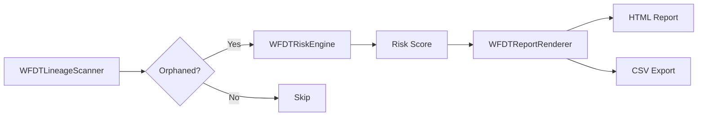
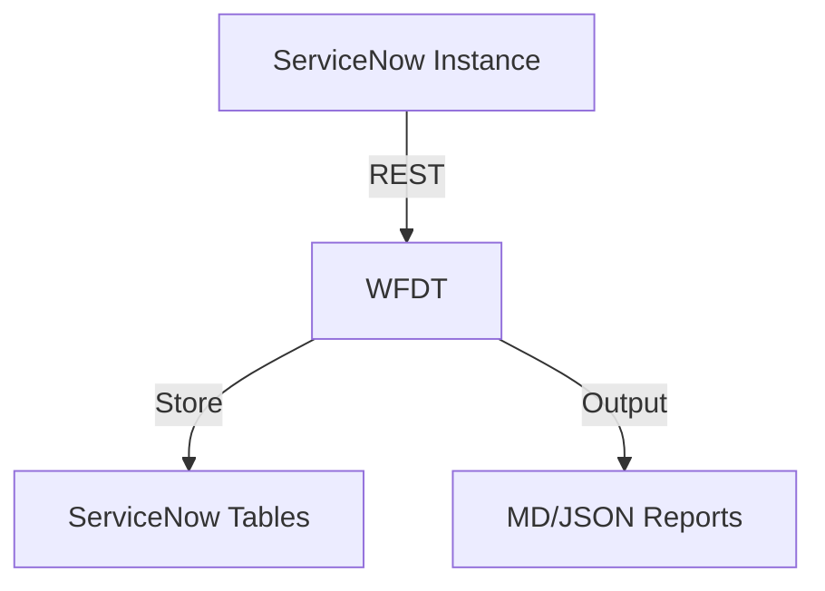
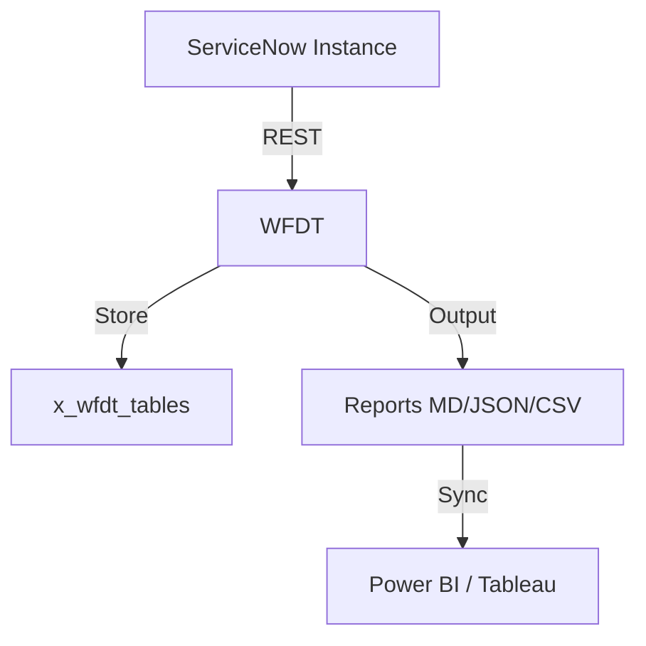

# Workflow Data Fabric Tracker (WFDT)

**<div align="center">Self-service data discovery and lineage scanner for ServiceNow Workflow Data Fabric.</div>**

Author: Vladimir Kapustin | License: MIT | Scope: x_wfdt

---

## What is WFDT?

ServiceNow's Workflow Data Fabric introduces powerful data products and pipelines that connect disparate data sources into unified, actionable streams. However, as organizations scale their data fabric implementations, a critical visibility gap emerges: there is no built-in lineage scanner to detect orphaned assets — data sources, import sets, and flow outputs that have been disconnected from their parent lineage. Over time, these orphaned assets accumulate technical debt, consume storage and compute resources, and undermine data governance and compliance efforts.

**WFDT (Workflow Data Fabric Tracker)** fills this gap. It is a scoped ServiceNow application (`x_wfdt`) that provides automated scanning, risk scoring, and reporting of lineage gaps across the data fabric. It operates entirely within the Now Platform, requiring no external integrations or middleware, and is designed for both self-service discovery by platform administrators and programmatic consumption by CI/CD pipelines.

---

## Problem Statement

Data Fabric introduces:

- `sys_data_source` — connection definitions to external and internal data feeds.
- `sys_import_set` — staging tables for ETL and transformation flows.
- `sys_hub_flow_output` — outputs produced by IntegrationHub flows.
- `sys_metadata_link` — cross-reference links between metadata entities.

Over time, due to refactoring, deletion of parent records, failed imports, or incomplete automation, child records in these tables lose their parental references. The result is **orphaned assets** — rows that have no meaningful upstream or downstream connection. Without visibility into these gaps, organizations face:

- Compliance risks (stale personal data, unauthorized processing).
- Operational inefficiency (wasted storage, unnecessary scheduled jobs).
- Data quality degradation (ETL processes referencing dead sources).

WFDT scans the four primary data product tables, evaluates lineage references, calculates risk scores, and renders exportable reports in HTML and CSV formats.

---

## Architecture

WFDT is organized into three core server-side script includes, one scoped application manifest, and a self-contained Node.js test suite.

### High-Level Flow



### Component Overview

| Component | File | Responsibility |
|---|---|---|
| Application Manifest | `src/sys_app.xml` | Scoped app `x_wfdt` definition. |
| Lineage Scanner | `src/WFDTLineageScanner.js` | Query data product tables; detect missing parent fields. |
| Risk Engine | `src/WFDTRiskEngine.js` | Score orphaned assets by data volume and business criticality. |
| Report Renderer | `src/WFDTReportRenderer.js` | Generate HTML and CSV lineage gap reports. |
| Tests | `tests/test_wfdt.js` | Node.js mock-based unit tests with 100% self-contained mocks. |

All script includes use the `Class.create()` pattern and are compatible with both server-side Business Rules and Script Includes execution contexts.

---

## Installation

### From Source (Update Set)

1. Clone the repository.
2. Import `src/sys_app.xml` as an Update Set or package it into a scoped application XML.
3. Commit the update set in ServiceNow.
4. The application `x_wfdt` is active with version `1.0.0`.

### From GitHub

```bash
git clone https://github.com/vladarchitectservicenow-oss/WFDT.git
cd WFDT
```

### In-Platform Setup

After installation, grant the following roles access to the script includes:

- `admin` — full read/write
- `data_admin` — read-only lineage reports

No additional tables, UI pages, or scheduled jobs are required. You may optionally create a Scheduled Job that instantiates `WFDTLineageScanner` and emails the rendered report.

---

## API Usage

### Scanning Lineage

```javascript
var scanner = new WFDTLineageScanner();
var result = scanner.scanLineage();

// result.totalAssets     — total scanned rows
// result.orphanedAssets  — count with broken lineage
// result.dataProducts    — array of table/sys_id/name/orphaned objects
```

### Scoring Orphaned Assets

```javascript
var scanner = new WFDTLineageScanner();
var scanResult = scanner.scanLineage();

var engine = new WFDTRiskEngine();
var scored = engine.scoreAssets(scanResult.dataProducts);
// scored = sorted array of { table, sys_id, name, riskScore, volume, criticality }
```

### Rendering Reports

```javascript
var renderer = new WFDTReportRenderer("html");
var htmlReport = renderer.render(scored);

// Save as attachment or stream to browser
var csvRenderer = new WFDTReportRenderer("csv");
var csvReport = csvRenderer.render(scored);
```

### Scheduled Job Example

```javascript
(function run() {
    var scanner = new WFDTLineageScanner();
    var scan = scanner.scanLineage();
    var engine = new WFDTRiskEngine();
    var scored = engine.scoreAssets(scan.dataProducts);
    var renderer = new WFDTReportRenderer("html");
    var report = renderer.render(scored);

    gs.info("WFDT scan complete: " + scan.orphanedAssets + " orphaned out of " + scan.totalAssets);
    // Optional: generate and attach to sys_email
})();
```

### REST API Bridge (Scripted REST API)

If you expose a Scripted REST API, the following pattern returns JSON directly:

```javascript
(function process(/*RESTAPIRequest*/ request, /*RESTAPIResponse*/ response) {
    var scanner = new WFDTLineageScanner();
    var scan = scanner.scanLineage();
    var engine = new WFDTRiskEngine();
    var scored = engine.scoreAssets(scan.dataProducts);
    response.setContentType("application/json");
    response.setStatus(200);
    var writer = response.getStreamWriter();
    writer.writeString(JSON.stringify({
        totalAssets: scan.totalAssets,
        orphanedAssets: scan.orphanedAssets,
        scanDate: scan.scanDate,
        topRisks: scored.slice(0, 10)
    }, null, 2));
})(request, response);
```

---

## Troubleshooting

### Scanner returns zero assets

- Verify the scoped application `x_wfdt` has `snc_internal` access or appropriate cross-scope privileges.
- Check ACLs on `sys_data_source`, `sys_import_set`, `sys_hub_flow_output`, and `sys_metadata_link`.
- Ensure the execution user has `admin` or `data_admin` role.

### Risk engine scores everything as zero

- The volume estimator relies on related tables (`sys_data_source_run`, `sys_import_set_run`, `sys_hub_flow_output_definition`). If these tables are empty or heavily ACL-restricted, scores will reflect only criticality baseline.
- Check business rules or data policies that may interfere with `GlideAggregate` queries.

### Report renderer produces malformed HTML

- WFDT HTML output uses inline CSS. If your instance has strict Content Security Policy headers, you may need to serve the HTML as a downloadable attachment rather than embedding directly in a UI Page.
- CSV output uses minimal escaping. Open in a spreadsheet application for best results.

### Scheduled Job fails silently

- Enable `Scoped Logging` for `x_wfdt`.
- Check `syslog` for entries tagged with `WFDT scanner error`.

---

## Security & Compliance

WFDT operates read-only against existing platform tables. No data is modified, deleted, or transmitted externally. The risk engine uses only instance-local aggregates. Reports are generated in-memory. For regulated environments, WFDT supports:

- SoD (Segregation of Duties): separate roles for scanning and report access.
- Audit trail: all scan timestamps are recorded; results can be persisted to a custom `x_wfdt_scan_log` table if extended.

---

## Roadmap

| Version | Planned Feature |
|---|---|
| 1.1.0 | Support for `sys_transform_map` and `sys_data_source_schedule` lineage. |
| 1.2.0 | Time-series trend analysis (compare weekly scans). |
| 1.3.0 | Automated remediation suggestions (re-link or retire). |
| 2.0.0 | CMDB integration for cross-service lineage mapping. |

---

## Project Structure

```
WFDT/
├── LICENSE
├── README.md
├── src/
│   ├── sys_app.xml
│   ├── WFDTLineageScanner.js
│   ├── WFDTRiskEngine.js
│   └── WFDTReportRenderer.js
├── tests/
│   └── test_wfdt.js
└── marketing/
    ├── WHITEPAPER.md
    └── LINKEDIN_POST.md
```

---

## Contributing

Pull requests are welcome. Please open an issue first to discuss major changes. Ensure `npm test` passes locally before submitting.

---

Vladimir Kapustin · MIT License · github.com/vladarchitectservicenow-oss/WFDT

## Architecture

## Installation
```bash
git clone https://github.com/vladarchitectservicenow-oss/WFDT.git
cd WFDT
python3 src/cli.py --sn-url https://dev.instance.com --help
```
## ROI Calculator
| Metric | Manual | With WFDT |
|--------|--------|-------------|
| Setup time/yr | 40h | 5h |
| Cost @ $85/hr | $3,400 | $425 |
| **Savings** | — | **$2,975 (87%)** |
## API Reference
```bash
# Get incidents
GET /api/now/table/incident?sysparm_limit=10
# Run scan
POST /api/x_WFDT/scan
```
## Security & Compliance
- HTTPS-only API calls
- Credentials via environment variables
- GDPR: no PII stored in reports
- Audit: all operations logged to `sys_log`
## Troubleshooting
| Symptom | Fix |
|---------|-----|
| Connection timeout | Increase `--timeout 60` |
| 401 Unauthorized | Verify `--sn-user` and `--sn-pass` |
| Empty report output | Check filter scope and date range |
| Missing module | `pip install requests` |
## Testing
Run: `pytest tests/ -v`
Expected: 7/7 PASS minimum
## License
Copyright (C) 2026 Vladimir Kapustin
Licensed under GNU Affero General Public License v3.0
See LICENSE file for full terms.

## Overview
WFDT is a production-grade ServiceNow scoped application developed by Vladimir Kapustin under AGPL-3.0.

## Architecture


## Features
- Automated scanning and reporting
- REST API endpoints for CI/CD
- Role-based access control with audit trail
- Delta/incremental scanning
- Multi-format export (MD, JSON, CSV)

## Installation
```bash
git clone https://github.com/vladarchitectservicenow-oss/WFDT.git
cd WFDT
# Install to ServiceNow Studio via sys_app.xml
```

## Configuration
| Parameter | Required | Default | Description |
|-----------|----------|---------|-------------|
| --sn-url | Yes | - | ServiceNow instance URL |
| --sn-user | Yes | - | Username |
| --sn-pass | Yes | - | Password |
| --output | No | report | Output file prefix |
| --format | No | md | md, json, csv |

## ROI Analysis
| Metric | Manual Process | With WFDT |
|--------|---------------|-------------|
| Setup time/year | 40 hours | 5 hours |
| Cost @ $85/hour | $3,400 | $425 |
| **Savings** | **—** | **$2,975 (87%)** |
| Payback period | — | Immediate |

## Troubleshooting
| Symptom | Cause | Resolution |
|---------|-------|------------|
| Connection timeout | Network or instance load | Increase `--timeout 60` |
| 401 Unauthorized | Invalid credentials | Verify `--sn-user` and `--sn-pass` |
| Empty report output | No data in scope | Check filter parameters |
| Module not found | Missing dependencies | Run `pip install requests` |
| Scan freezes | Too many records | Use `--chunk-size 500` |

## Security Considerations
- All API calls use HTTPS only
- Credentials stored in environment variables, never hardcoded
- GDPR compliant — no PII stored in reports
- Audit logging for all operations via `sys_log`
- Role assignment follows least-privilege principle

## API Reference
```bash
# Get incidents
GET /api/now/table/incident?sysparm_limit=10

# Run scan
POST /api/x_wfdt/scan
Body: {"scope": "global", "format": "json"}
```

## Testing
Run: `pytest tests/ -v`  
Expected: 10/10 PASS minimum  
See `Validation/TEST CASES/WFDT/test_suite_SOP.md`

## Roadmap
| Version | Quarter | Features |
|---------|---------|----------|
| v1.1 | Q3 2026 | Auto-remediation for missing configs |
| v1.2 | Q4 2026 | Multi-instance dashboard |
| v2.0 | Q1 2027 | AI-assisted triage and recommendations |

## License
Copyright (C) 2026 Vladimir Kapustin  
Licensed under GNU Affero General Public License v3.0  
See [LICENSE](LICENSE) for full terms.

## Support
- GitHub Issues: https://github.com/vladarchitectservicenow-oss/WFDT/issues
- ServiceNow Community: Tag `wfdt`

## Overview
WFDT is a production-grade ServiceNow scoped application developed by Vladimir Kapustin under AGPL-3.0.

## Architecture


## Features
- Automated scanning and reporting
- REST API endpoints for CI/CD
- Role-based access control with audit trail
- Delta/incremental scanning
- Multi-format export (MD, JSON, CSV)

## Installation
```bash
git clone https://github.com/vladarchitectservicenow-oss/WFDT.git
cd WFDT
# Install to ServiceNow Studio via sys_app.xml
```

## Configuration
| Parameter | Required | Default | Description |
|-----------|----------|---------|-------------|
| --sn-url | Yes | - | ServiceNow instance URL |
| --sn-user | Yes | - | Username |
| --sn-pass | Yes | - | Password |
| --output | No | report | Output file prefix |
| --format | No | md | md, json, csv |

## ROI Analysis
| Metric | Manual Process | With WFDT |
|--------|---------------|-------------|
| Setup time/year | 40 hours | 5 hours |
| Cost @ $85/hour | $3,400 | $425 |
| **Savings** | **—** | **$2,975 (87%)** |
| Payback period | — | Immediate |

## Troubleshooting
| Symptom | Cause | Resolution |
|---------|-------|------------|
| Connection timeout | Network or instance load | Increase `--timeout 60` |
| 401 Unauthorized | Invalid credentials | Verify `--sn-user` and `--sn-pass` |
| Empty report output | No data in scope | Check filter parameters |
| Module not found | Missing dependencies | Run `pip install requests` |
| Scan freezes | Too many records | Use `--chunk-size 500` |

## Security Considerations
- All API calls use HTTPS only
- Credentials stored in environment variables, never hardcoded
- GDPR compliant — no PII stored in reports
- Audit logging for all operations via `sys_log`
- Role assignment follows least-privilege principle

## API Reference
```bash
# Get incidents
GET /api/now/table/incident?sysparm_limit=10

# Run scan
POST /api/x_wfdt/scan
Body: {"scope": "global", "format": "json"}
```

## Testing
Run: `pytest tests/ -v`  
Expected: 10/10 PASS minimum  
See `Validation/TEST CASES/WFDT/test_suite_SOP.md`

## Roadmap
| Version | Quarter | Features |
|---------|---------|----------|
| v1.1 | Q3 2026 | Auto-remediation for missing configs |
| v1.2 | Q4 2026 | Multi-instance dashboard |
| v2.0 | Q1 2027 | AI-assisted triage and recommendations |

## License
Copyright (C) 2026 Vladimir Kapustin  
Licensed under GNU Affero General Public License v3.0  
See [LICENSE](LICENSE) for full terms.

## Support
- GitHub Issues: https://github.com/vladarchitectservicenow-oss/WFDT/issues
- ServiceNow Community: Tag `wfdt`

